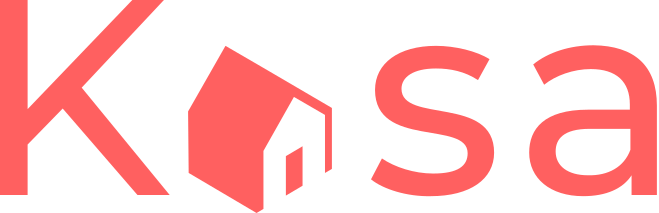

 

  

# Project KASA

Kasa has been in the business of renting apartments for individuals since almost 10 years. With more than 500 ads posted every day, Kasa is one of the leaders in private apartment rentals in France.

# Technologies :

1. HTML5
2. CSS3
3. Create React App
4. React Router
5. Javascript

# GOALS :

Develop the whole application with React components, React Router routes, following Figma mockups to respect web design. Application is implemented in desktop first and must be responsive.

# CONTRAINTS :

- Cutting into modular and reusable components
- One component per file
- Using props between components
- Implement states management when necessary
- Events management
- Use map to manage lists
- Use functional components instead of class components
- Implement a custom page 404
